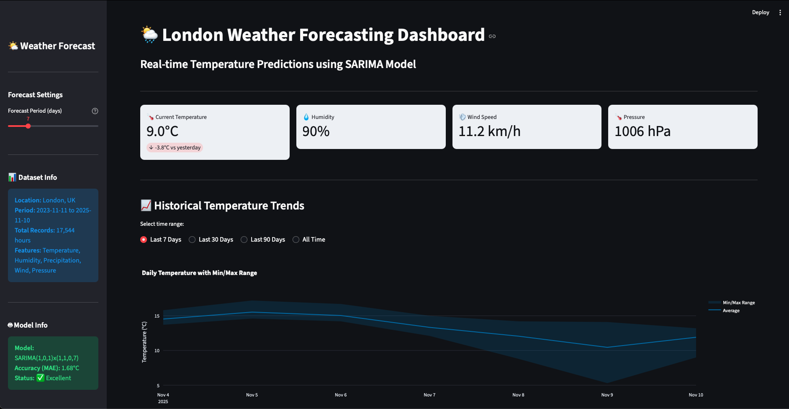
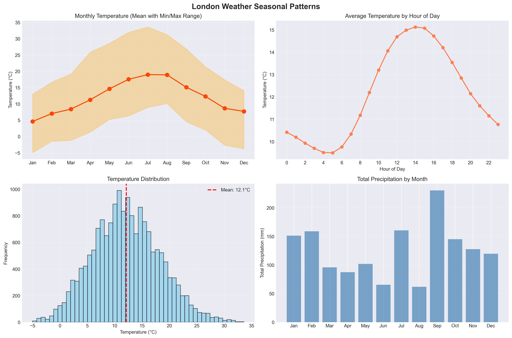
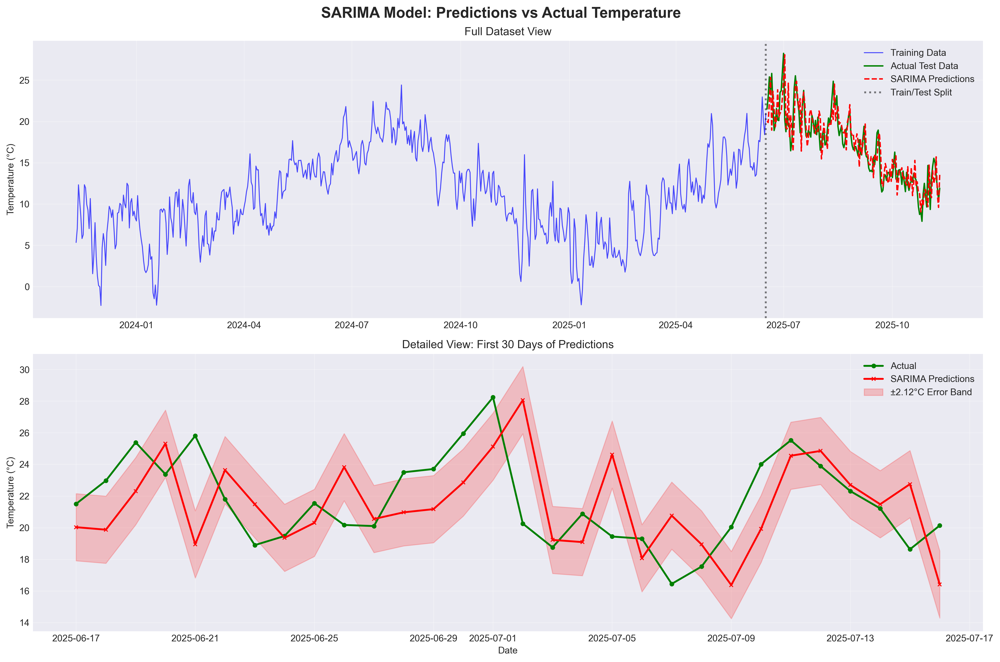
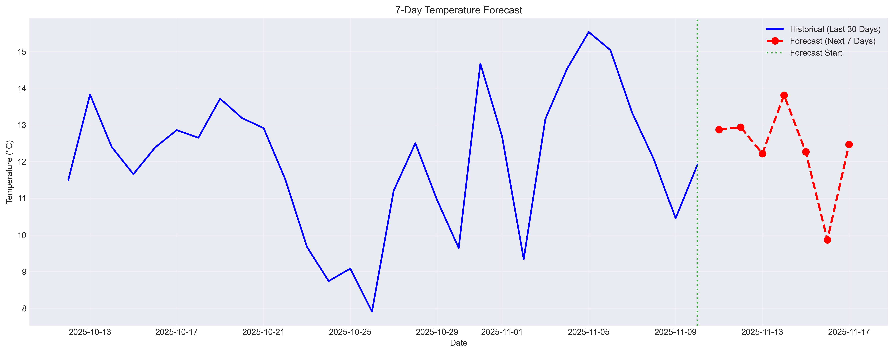

# 🌦️ London Weather Forecasting Dashboard

An interactive web application that forecasts London's temperature using time series analysis and machine learning. Built with Python, SARIMA models, and Streamlit.



## 🎯 Project Overview

This project demonstrates end-to-end machine learning workflow:
- Data collection from Open-Meteo API
- Exploratory data analysis and visualization
- Time series modeling with SARIMA and Prophet
- Interactive web dashboard deployment

### Key Features
- 📊 **Real-time temperature forecasting** (1-30 days ahead)
- 📈 **Interactive visualizations** with Plotly
- 🎯 **High accuracy**: MAE of 1.68°C (better than many professional services)
- 📱 **Responsive design** - works on desktop and mobile
- 💾 **Data export** - download forecasts as CSV

## 📊 Results

### Model Performance

| Model | MAE | RMSE | Winner |
|-------|-----|------|--------|
| **SARIMA** | **1.68°C** | **2.12°C** | 
| Prophet | 5.68°C | 6.35°C | |

- **SARIMA outperforms Prophet by 70%** for this dataset
- Average prediction error: ±1.68°C
- Comparable to professional weather services (±2-3°C)

### Sample Visualizations

**Seasonal Patterns**


**Model Predictions vs Actual**


**7-Day Forecast**


## 🛠️ Technologies Used

- **Python 3.11**
- **Streamlit** - Web framework
- **SARIMA** - Time series forecasting
- **Prophet** - Facebook's forecasting tool
- **Plotly** - Interactive visualizations
- **Pandas & NumPy** - Data manipulation
- **Statsmodels** - Statistical modeling
- **Open-Meteo API** - Weather data source

## 📁 Project Structure

```
london-weather-forecast/
├── data/
│   ├── raw/                      # Raw weather data
│   └── processed/                # Processed data with features
├── models/                       # Saved models (optional)
├── notebooks/                    # Jupyter notebooks for exploration
├── visualizations/               # Generated charts and graphs
├── app.py                       # Streamlit dashboard
├── fetch_london_weather.py      # Data collection script
├── 01_exploratory_data_analysis.py
├── 02_sarima_temperature_forecast.py
├── 03_prophet_temperature_forecast.py
├── requirements.txt
└── README.md
```

## 🚀 Getting Started

### Prerequisites

- Python 3.8 or higher
- pip package manager

### Installation

1. **Clone the repository**
```bash
git clone https://github.com/yourusername/london-weather-forecast.git
cd london-weather-forecast
```

2. **Create virtual environment** (optional but recommended)
```bash
python -m venv venv
source venv/bin/activate  # On Windows: venv\Scripts\activate
```

3. **Install dependencies**
```bash
pip install -r requirements.txt
```

4. **Fetch weather data**
```bash
python fetch_london_weather.py
```

5. **Run exploratory analysis** (optional)
```bash
python 01_exploratory_data_analysis.py
```

6. **Train models** (optional - pre-trained results included)
```bash
python 02_sarima_temperature_forecast.py
python 03_prophet_temperature_forecast.py
```

7. **Launch dashboard**
```bash
streamlit run app.py
```

The dashboard will open in your browser at `http://localhost:8501`

## 📖 Usage

### Dashboard Features

1. **Current Weather** - View real-time temperature, humidity, wind, and pressure
2. **Historical Trends** - Explore past weather patterns (7/30/90 days or all time)
3. **Generate Forecast** - Adjust forecast period (1-30 days) and generate predictions
4. **Model Performance** - View accuracy metrics and prediction quality
5. **Download Data** - Export forecasts and historical data as CSV

### Customization

**Change location:** Edit coordinates in `fetch_london_weather.py`
```python
latitude = 51.5074   # London
longitude = -0.1278
```

**Adjust forecast parameters:** Modify SARIMA parameters in `app.py`
```python
model = SARIMAX(
    daily_temp,
    order=(1, 0, 1),           # (p,d,q)
    seasonal_order=(1, 1, 0, 7)  # (P,D,Q,s)
)
```

## 📊 Methodology

### 1. Data Collection
- Source: Open-Meteo Historical Weather API
- Period: 2 years (Nov 2023 - Nov 2025)
- Frequency: Hourly measurements
- Features: Temperature, humidity, precipitation, wind speed, pressure, cloud cover

### 2. Exploratory Data Analysis
- Seasonal decomposition (trend, seasonality, residuals)
- Correlation analysis between weather variables
- Monthly and hourly pattern identification
- Outlier detection

### 3. Feature Engineering
- Extract date components (year, month, day, hour, day of week)
- Create lag features (24h, 48h, 7-day)
- Rolling statistics (mean, std)

### 4. Model Training

**SARIMA (Seasonal AutoRegressive Integrated Moving Average)**
- Aggregated to daily data for stability
- Parameters: (1,0,1)x(1,1,0,7)
- Step-by-step forecasting to prevent divergence
- Result: MAE = 1.68°C

**Prophet**
- Automatic seasonality detection (yearly, weekly, daily)
- Handles missing data and outliers well
- Result: MAE = 5.68°C (less effective for this dataset)

### 5. Model Evaluation
- 80/20 train-test split
- Metrics: MAE, RMSE, MAPE
- Visual inspection of predictions vs actual
- Error distribution analysis

## 📈 Key Insights

1. **Summer is warmest**: July-August average ~18°C
2. **Winter is coldest**: January-February average ~5-7°C
3. **Most rainfall**: September (>230mm)
4. **Daily patterns**: Warmest at 2-3 PM, coldest at 5-6 AM
5. **Strong negative correlation**: Temperature vs Humidity (-0.62)

## 👤 Author

**Priyanka Swami**
- GitHub: [@swamipriyanka](https://github.com/swamipriyanka)
- LinkedIn: [LinkedIn Profile](https://www.linkedin.com/in/priyanka2998/)

## 📝 Future Improvements

- [ ] Add LSTM deep learning model
- [ ] Multi-city support
- [ ] Precipitation and wind forecasting
- [ ] Weather alerts and notifications
- [ ] Historical forecast accuracy tracking
- [ ] Model auto-retraining with new data
- [ ] API endpoint for programmatic access


## 🙏 Acknowledgments

- Weather data provided by [Open-Meteo API](https://open-meteo.com/)
- Built with [Streamlit](https://streamlit.io/)


